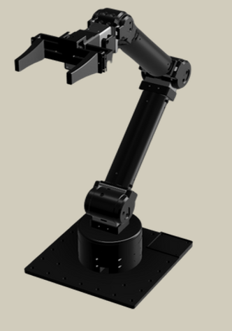
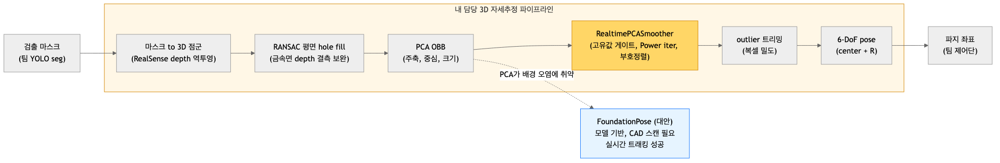
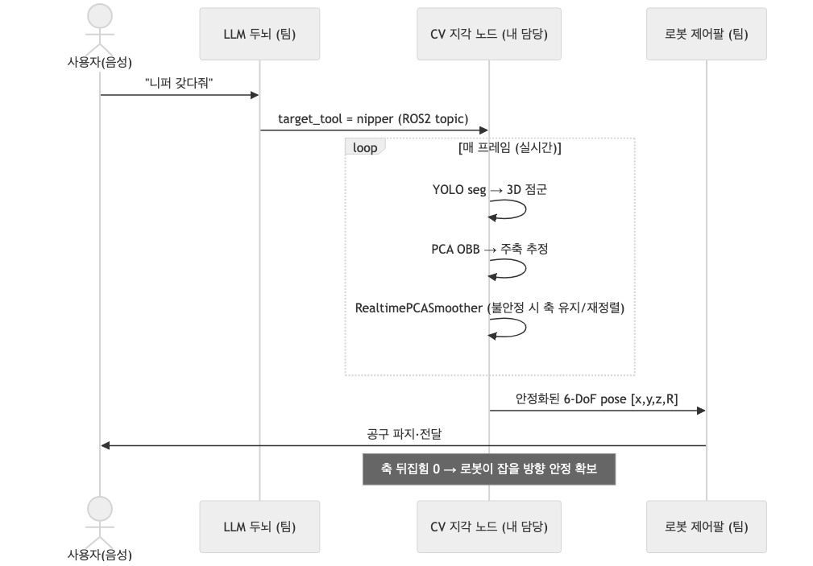
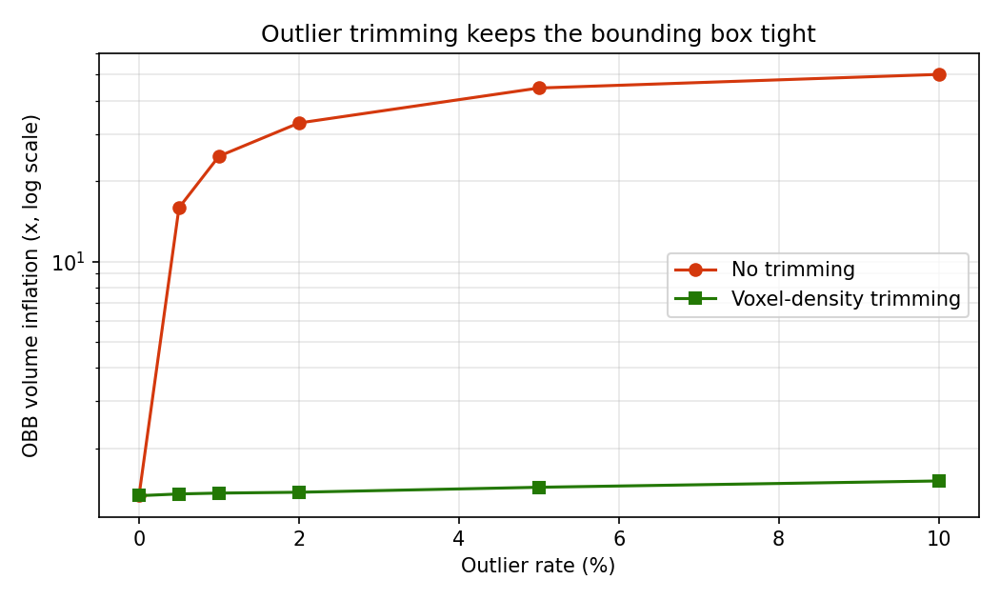
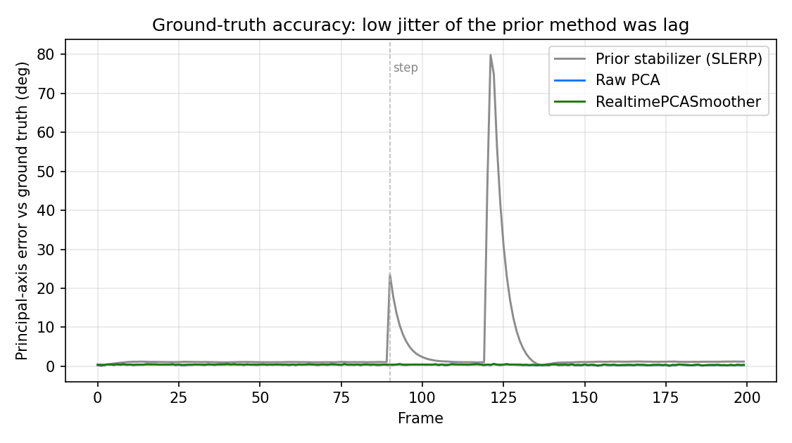
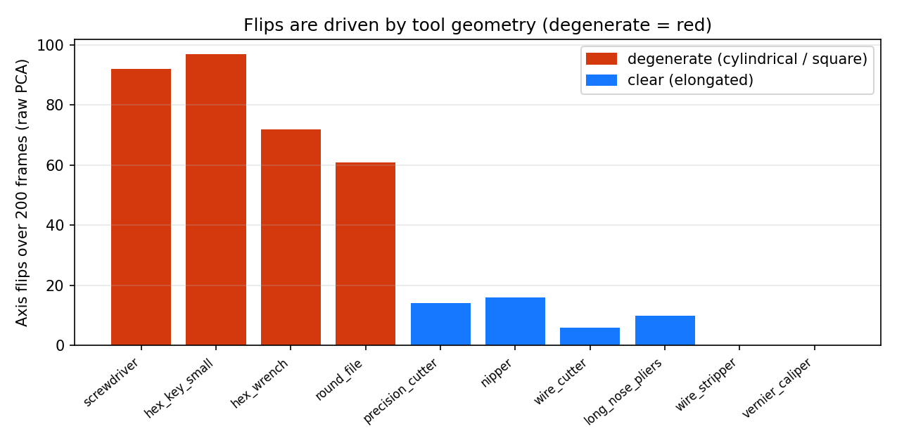
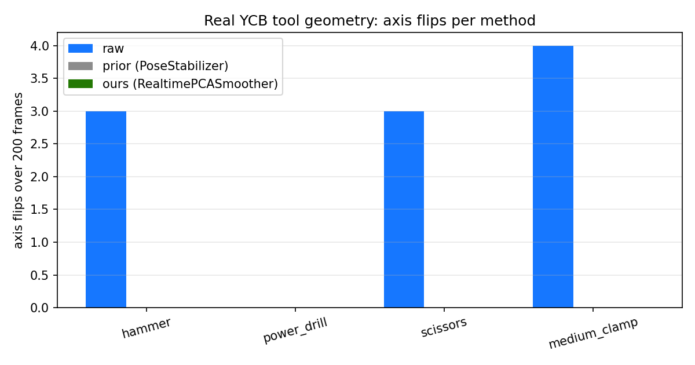

# aiot_cv: 로봇팔 공구 파지를 위한 3D 자세추정

AIoT 창의적 종합설계 경진대회(2025) 협동 로봇팔 프로젝트의 컴퓨터 비전 파트입니다.
음성 명령으로 지목한 공구를 로봇팔이 인식해 건네주는 시스템에서, 검출 이후의 3D 자세추정 파이프라인을 담당


> 역할: 3D PCA 기반 자세추정, 자세 안정화, FoundationPose 전환 탐색

<p align="center">
  
</p>

<p align="center"><sub>프로젝트에 사용한 협업 로봇팔 플랫폼</sub></p>

## 파이프라인



검출 마스크를 입력으로 받아 3D 자세를 출력하는 흐름입니다.

## 시스템에서의 위치

전체 시스템은 음성 명령(LLM), 지각(CV), 로봇 제어의 세 부분으로 나뉩니다. 제가 맡은 CV 지각 노드가 매 프레임 자세를 계산해 제어단으로 넘깁니다.



## 문제 상황

대상 공구가 니퍼, 커터, 캘리퍼스처럼 대부분 얇고 금속 재질이었고 센서는 단일 RealSense D435i 하나였습니다. 여기서 두 레이어의 문제가 있었습니다.

1. 깊이 결측(depth hole). 금속 표면은 적외선을 반사해 깊이가 통째로 비었습니다. 얇은 형상과 근접 촬영도 결측을 키웠습니다.
2. 3D 경계 박스가 프레임마다 튀는 현상. 원인은 PCA 고유벡터의 성질에 있었습니다.
   - 부호 모호성: 고유벡터는 v와 -v가 같은 해라 방향이 프레임마다 뒤집힙니다.
   - 축 교환: 고유값이 비슷하면 노이즈로 두 축이 서로 바뀝니다.
   - 퇴화: 원통이나 정사각 단면처럼 분산이 비슷한 형상은 축 방향이 정의되지 않아 무작위로 회전합니다.
   - 이상치: 배경이나 반사로 생긴 점이 공분산을 흔들어 축이 떨립니다.

추가로, PCA는 마스크 안의 모든 점을 평균 내는 전역 모멘트 계산이라 세그멘테이션 오차나 배경 평면이 섞이면 주축이 물체가 아니라 바닥을 따라갑니다.

## 해결 방법

세 갈래로 접근했습니다.

1. 깊이 결측 보완. RANSAC 평면 피팅으로 평면 물체의 빈 깊이를 채웠습니다. 카메라 좌표계 보정과 다운샘플링, 깊이 클램프 튜닝을 함께 적용했습니다. (`src/pca_obb_pose.py`)
2. 자세 안정화. 고유값 비율로 안정과 불안정을 판정하고, 불안정하면 Power iteration으로 주축만 근사 재계산하며, 직전 프레임과 부호를 맞춰 뒤집힘을 제거했습니다. (`src/realtime_pca_smoother.py`)
3. 이상치 제거. 복셀 밀도 기반으로 고립된 점을 걸러 경계 박스가 부풀지 않게 했습니다. (`experiments/pca_integrated_final.py`)

### 참고한 것

- PCA 기반 OBB: 공분산 고유분해로 주축을 구해 경계 박스를 만드는 표준 방식.
- Power iteration: 전체 고유분해 없이 최대 고유벡터만 반복곱으로 근사하는 방법. ([velog: EVD 없이 Eigenvalue 찾기](https://velog.io/@cleansky/EVD-%EC%97%86%EC%9D%B4-Eigenvalue-%EC%B0%BE%EA%B8%B0-Power-Iteration-Power-Method))
- 고유공간 섭동 이론(Davis-Kahan): 고유값이 붙어 있을수록 고유벡터가 노이즈에 불안정하다는 배경.
- FoundationPose (CVPR 2024): CAD 모델 기반 6-DoF 자세추정 및 트래킹. ([논문/코드](https://github.com/NVlabs/FoundationPose))
- RealSense 깊이 처리: 공식 SDK의 spatial, temporal, hole filling 필터.

## 실험과 검증

만든 방법이 실제로 도움이 되는지 스스로 검증했습니다. 지표 정의가 결과를 미리 정하지 않도록, 정답 자세를 아는 합성 시퀀스에서 정확도를 측정했습니다.

| 실험 | 파일 | 핵심 결과 |
| --- | --- | --- |
| 공구 10종 벤치마크 | `experiments/pca_multitool_benchmark.py` | 방식별 속도, 축 뒤집힘, 안정성 비교 CSV |
| 반복 유무 비교 | `experiments/pca_repeat_benchmark.py` | 안정 프레임에서 재계산을 건너뛰는 효과 측정 |
| 정답 대비 정확도 | `experiments/pca_groundtruth_experiment.py` | 자세 안정화가 정확도가 아니라 부호 연속성만 준다는 확인 |
| 통합 기여도 | `experiments/pca_integrated_final.py` | 단계별 실측 기여도 CSV |

정직한 결론은 다음과 같습니다.

- 이상치 제거가 실질 개선입니다. 이상치 10퍼센트 환경에서 경계 박스 부피 팽창을 약 50배에서 약 1.5배로 줄였습니다.
- PCA 주축 자체는 이미 정확합니다. 부분 관측에서도 정답 대비 약 0.2도 수준이었습니다.
- 자세 안정화(부호정렬)는 정확도를 올리지 않습니다. 화면상 축 뒤집힘을 없애는 시간 연속성만 제공합니다.
- 프레임 간 스무딩만 강하게 걸면 지연(lag)이 생겨 급격한 회전에서 오차가 커집니다.

아래는 실험 결과 차트입니다. 모두 위 스크립트가 생성한 CSV에서 나온 것이며, 생성 코드는 `docs/figures/make_figures.py`에 있습니다.



이상치가 늘어도 트리밍이 경계 박스 부피 팽창을 억제합니다. 이상치 10퍼센트에서 약 50배 팽창이 약 1.5배로 줄어듭니다. (`experiments/exp1_outlier_volume.csv`)



정답 자세 대비 주축 오차입니다. 기존 안정화(회색)는 급격한 회전 구간에서 크게 뒤처져, 낮은 흔들림이 정확도가 아니라 지연이었음을 보여줍니다. raw와 제 방식은 거의 겹쳐, 부호정렬이 정확도를 바꾸지 않음을 확인합니다. (`experiments/gt_per_frame.csv`)



축 뒤집힘 횟수는 물체 기하가 결정합니다. 원통이나 정사각 단면(빨강)이 심하게 뒤집히고, 길쭉한 공구(파랑)는 적습니다. 안정화를 적용하면 모든 공구에서 0으로 떨어집니다. (`experiments/bench_summary.csv`)

### 실제 YCB 공구 지오메트리 검증

합성 도형뿐 아니라 실제 공구 메시(YCB: hammer, power_drill, scissors, medium_clamp)를 표면 샘플링해 통제된 회전으로도 검증했습니다. **실제 공구에서도 raw PCA의 축 뒤집힘을 제거합니다(합계 raw 10회 → 0회).** 다만 정확도는 올리지 않으며, 퇴화 물체(medium_clamp)에서는 오히려 나빠집니다(축오차 6.8도 → 12.9도). 합성 결과와 같은 한계입니다. 자세 안정화는 시간축 문제라 물체가 움직이는 시퀀스에서만 의미가 있습니다. (`experiments/ycb_realdata_benchmark.py`, `experiments/ycb_summary.csv`)



실제 YCB 공구 지오메트리에서 방식별 축 뒤집힘. raw만 뒤집히고 안정화 방식은 0.

## FoundationPose 전환과 CAD 스캔

PCA 방식이 세그멘테이션과 배경 오염에 취약한 것을 확인하고, 모델 기반인 FoundationPose로 전환을 탐색했습니다. FoundationPose는 가정한 자세로 CAD 모델을 렌더링해 관측과 비교하는 방식이라, 배경 이상치가 모델과 맞지 않으면 자동으로 무시됩니다. 실제로 실시간 자세 트래킹까지 동작시켰습니다.

다만 실사용에는 조건이 있었습니다.

- 각 공구의 정확한 CAD 메시가 필요합니다. render-and-compare 방식이므로 모델이 실제 물체와 맞지 않으면 자세가 어긋납니다. 공구별 3D 스캔본을 확보해야 했습니다.
- 매끈하고 텍스처가 적은 물체는 렌더 비교 신호가 약해 초기화와 트래킹이 까다롭습니다.
- Docker와 GPU 환경 구성, 실시간 연산 부담이 있었습니다.

로봇팔 파지까지의 통합은 제가 팀을 나온 이후 진행되어 이 저장소에는 포함하지 않았습니다. FoundationPose 파이프라인 분석 문서는 `docs/foundationpose_analysis.md`에 있습니다.

## 저장소 구조

```
aiot_cv/
├── src/
│   ├── pca_obb_pose.py            # 마스크에서 3D 점군, RANSAC hole fill, PCA OBB, 6-DoF pose
│   └── realtime_pca_smoother.py   # 고유값 게이트, Power iteration, 부호정렬
├── experiments/
│   ├── pca_multitool_benchmark.py # 공구 10종 x 3방식 벤치
│   ├── pca_groundtruth_experiment.py
│   ├── pca_integrated_final.py    # 단계별 기여도 통합
│   ├── pca_repeat_benchmark.py
│   ├── bench_tools/               # 공구 10종 합성 점군 PLY
│   └── *.csv                      # 실험 결과
└── docs/
    ├── foundationpose_analysis.md # FoundationPose 파이프라인 분석
    ├── figures/                   # 실험 결과 차트 + 생성 스크립트(make_figures.py)
    └── diagrams/                  # 파이프라인, 시스템 시퀀스 다이어그램
```

## 실행

실험은 표준 numpy만 있으면 재현됩니다. 별도의 카메라나 학습 가중치가 필요 없습니다.

```bash
pip install numpy
python experiments/pca_integrated_final.py
python experiments/pca_groundtruth_experiment.py
```

실시간 파이프라인(`src/`)은 RealSense 카메라, OpenCV, pyrealsense2, Ultralytics YOLO 가중치가 필요합니다. 가중치와 데이터셋은 포함하지 않았습니다.
